<p align="center">
  <a href="../../releases">
    <picture>
      <source media="(prefers-color-scheme: dark)" srcset="docs/brand/artcraft-logo-white.svg">
      
    </picture>
  </a>
</p>


<h1 align="center">PdfCraft</h1>

<p align="center">
  <b>The PDF workbench; an open-source, clean-room reimplementation of Adobe Acrobat, rebuilt in pure Rust.</b><br>
  Read, organize, combine, split and secure PDFs in a fast, native app, written in Rust from the ground up.<br>
  macOS · Windows · Linux · FreeBSD · the web
</p>

<p align="center">
  
  
  
  
</p>

<br>

<p align="center">
  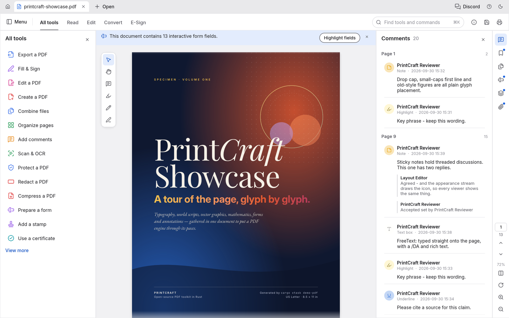
  <br>
  <sub>The PdfCraft Showcase, a 13-page specimen PDF, open with the All tools panel and threaded comments.</sub>
</p>

---

## Highlights

<table>
<tr>
<td width="33%" valign="top">

### Faithful
Real-world typography: world scripts, vertical Japanese, colour emoji, gradients, soft masks and transparency. All of it renders the way the author intended.

</td>
<td width="33%" valign="top">

### Fearless
Every save appends your changes and leaves the original bytes untouched. Writes are atomic, undo runs deep, and nothing is lost if you close by mistake.

</td>
<td width="33%" valign="top">

### Yours
No account, no telemetry, no cloud. It works offline and opens instantly. The engine, CLI and app are all open source.

</td>
</tr>
</table>

---

## Read anything, beautifully

PdfCraft renders PDFs with care for the details that make a page feel right: kerning and ligatures, right-to-left and complex scripts, vertical CJK, colour emoji, shadings, blend modes, soft masks and optional content.

<p align="center">
  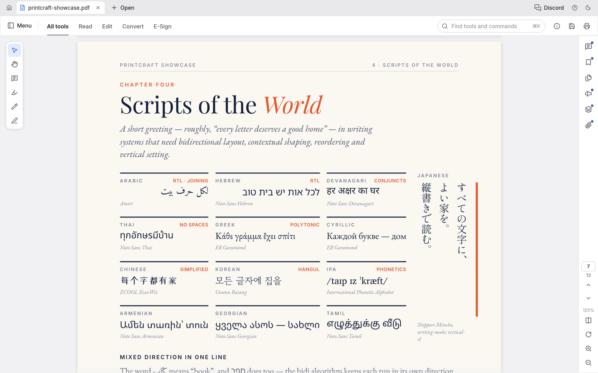
  <br>
  <sub>Twelve writing systems on one page, plus vertical Japanese, at 125%.</sub>
</p>

- **Deep zoom stays sharp.** Large pages render in tiles, so text stays crisp at any magnification.
- **Built to survive bad files.** Every page renders in isolation and damaged documents are repaired. Across the 983-file pdf.js test corpus the result is 0 crashes.
- **Layouts for every task:** continuous, single page, two-up, view rotation, full screen and a distraction-free Read mode.
- **Light and dark themes**, both designed to be easy on the eyes for long sessions.

<table>
<tr>
<td width="50%">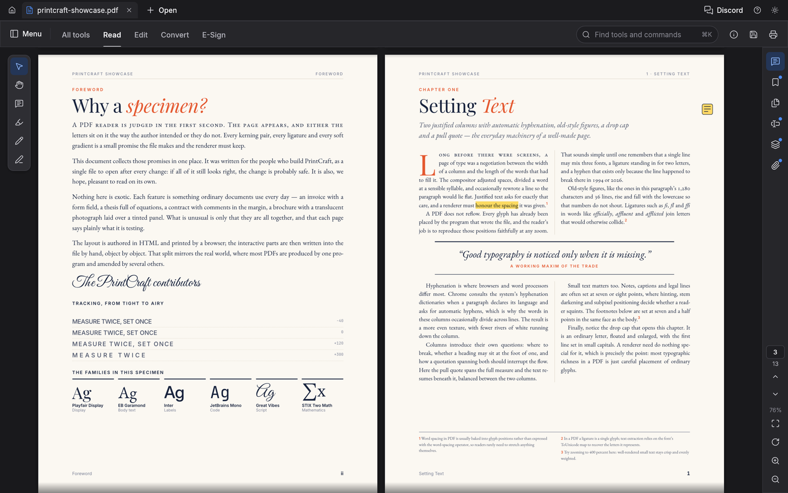</td>
<td width="50%">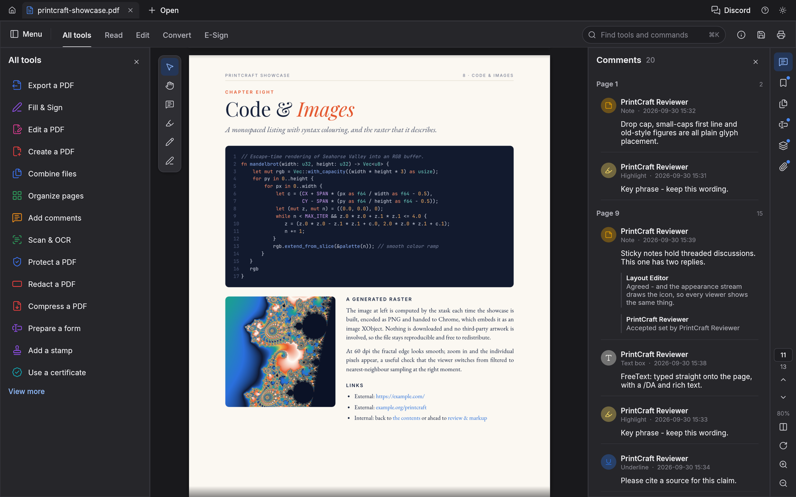</td>
</tr>
<tr>
<td align="center"><sub>Two-up Read mode, ready for long reading</sub></td>
<td align="center"><sub>The dark theme, with the comments panel open</sub></td>
</tr>
</table>

## Find it, select it, copy it

Search the whole document as you type, step through matches with <kbd>⌘G</kbd>, and select text that comes out in the right reading order. That holds for columns, right-to-left runs and CJK too.

## Navigate long documents

Bookmarks, page thumbnails and the document's own page labels (i, ii, 1, 2…) keep you oriented in long documents.

<table>
<tr>
<td width="50%">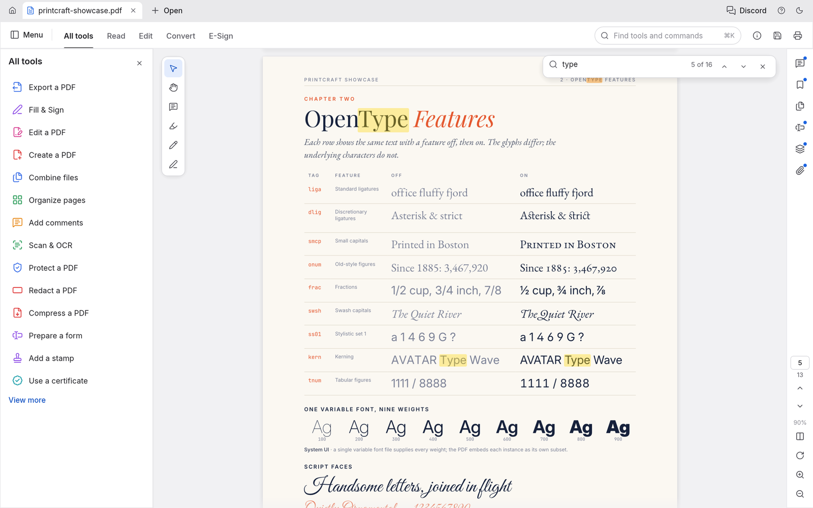</td>
<td width="50%">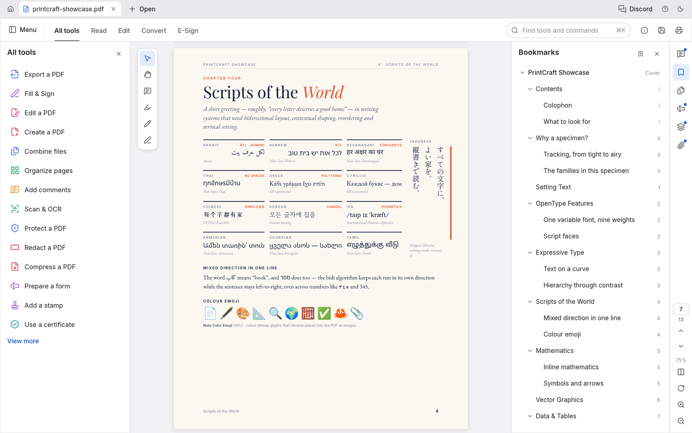</td>
</tr>
<tr>
<td align="center"><sub>Find as you type: match 10 of 16</sub></td>
<td align="center"><sub>Nested bookmarks with the document's own page labels</sub></td>
</tr>
</table>

---

## Organize pages like cards on a table

Open **Organize pages** to see every page at once:
- **Select pages:** click, <kbd>⌘</kbd>-click or <kbd>⇧</kbd>-click.
- **Change them:** rotate, delete, insert blank pages, insert pages from another file, and move them earlier or later.
- **Undo anything:** <kbd>⌘Z</kbd>, then save.

<p align="center">
  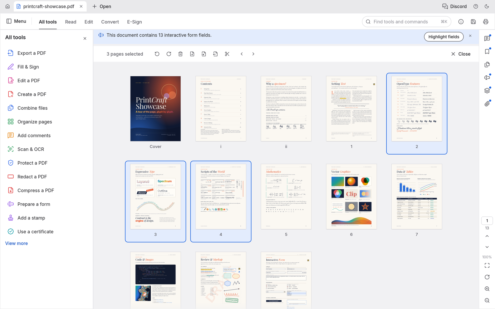
  <br>
  <sub>Organize pages with three pages selected and the page tools in the toolbar above.</sub>
</p>

<table>
<tr>
<td width="50%" valign="top">

**Undo that goes the distance.** Each change is one step in a history you can walk backwards and forwards. The Edit menu names the step ("Undo Rotate pages"), and undo still works after you save.

**Saves you can trust:**
- *Incremental:* the original bytes stay byte-for-byte intact.
- *Atomic:* the file is written to a temporary copy, then swapped in.
- *Verified:* independently checked with qpdf.

Unsaved documents carry a dot on their tab, and closing or quitting asks before anything is lost. Changes are autosaved every minute. If PdfCraft ever quits unexpectedly, it offers to recover your work the next time it opens. Encrypted documents stay encrypted on disk.

</td>
<td width="50%" valign="top">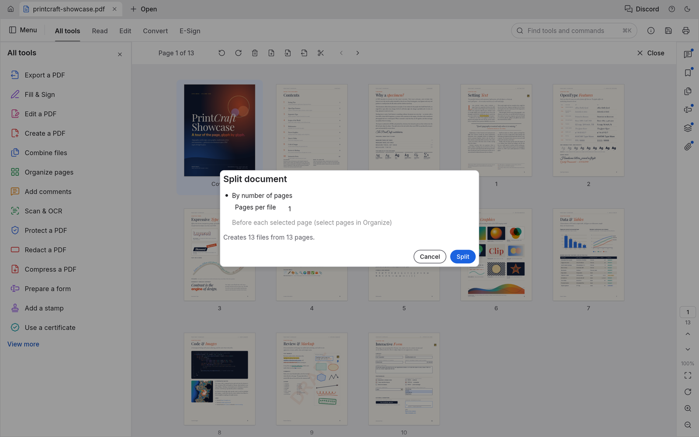<br><sub>Split document: one page per file makes 13 files.</sub></td>
</tr>
</table>

---

## Open protected documents and respect their rules

PdfCraft implements the PDF standard security handler completely:
- every revision, from 40-bit RC4 to AES-256;
- user and owner passwords, including Unicode passwords normalised with SASLprep;
- crypt filters and attachment-only encryption.

Documents restricted by their author show a clear notice, and PdfCraft honours their permissions. Enter the owner password and the restrictions lift. Edits to encrypted documents are saved encrypted, under the same keys.

<table>
<tr>
<td width="50%" valign="top">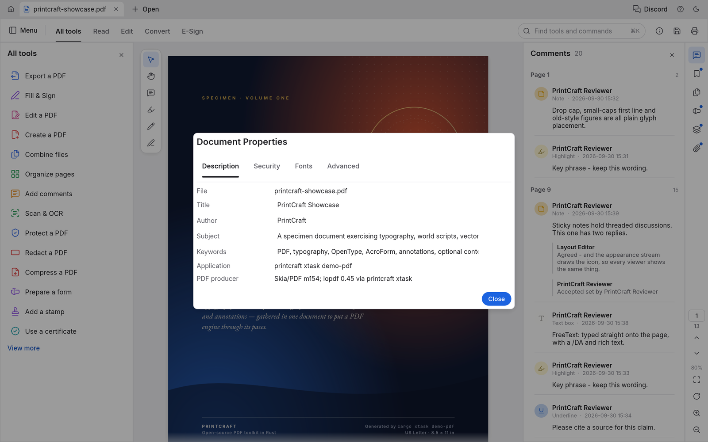<br><sub>Document Properties, Description tab</sub></td>
<td width="50%" valign="top">

**Document Properties** shows:
- the document's title, author, subject and keywords, which you can edit;
- the fonts it uses and whether each is embedded;
- PDF version, page size, tags, fields, layers and attachments;
- the full security picture: encryption method, which password opened it, and each permission.

</td>
</tr>
</table>

## Comments, forms, layers and attachments

<table>
<tr>
<td width="50%">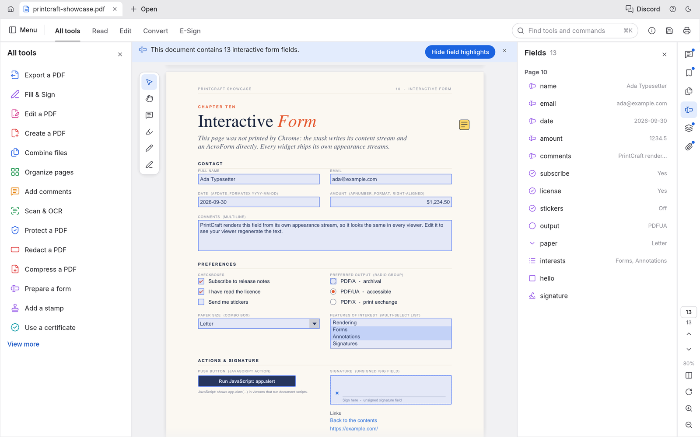</td>
<td width="50%">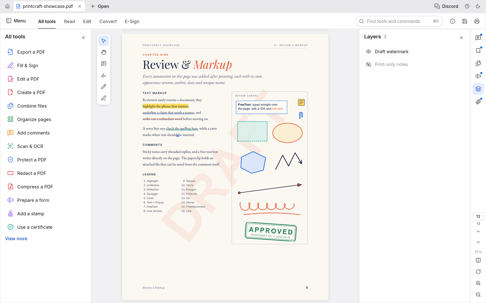</td>
</tr>
<tr>
<td valign="top"><b>Forms</b>: every field with its current value, field highlighting, and checkboxes, radio buttons, lists and signatures drawn the way their author designed them.</td>
<td valign="top"><b>Layers</b>: switch optional content on and off and the page re-renders instantly. <b>Comments</b> appear as threaded conversations, and <b>attachments</b> can be opened or saved.</td>
</tr>
</table>

## Every tool, one keystroke away

Press <kbd>⌘K</kbd> to search every tool and command, or browse the **All tools** catalogue. Tools that are still in development are marked with the milestone that will ship them.

<table>
<tr>
<td width="50%">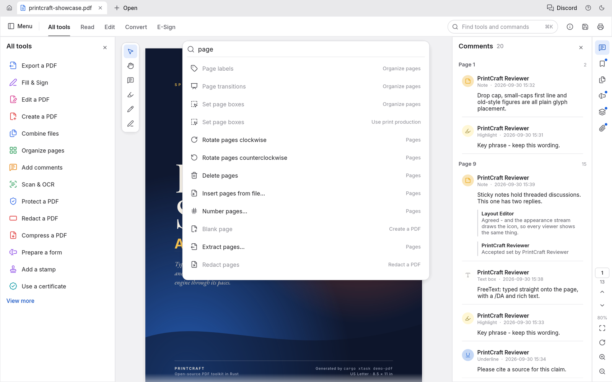</td>
<td width="50%">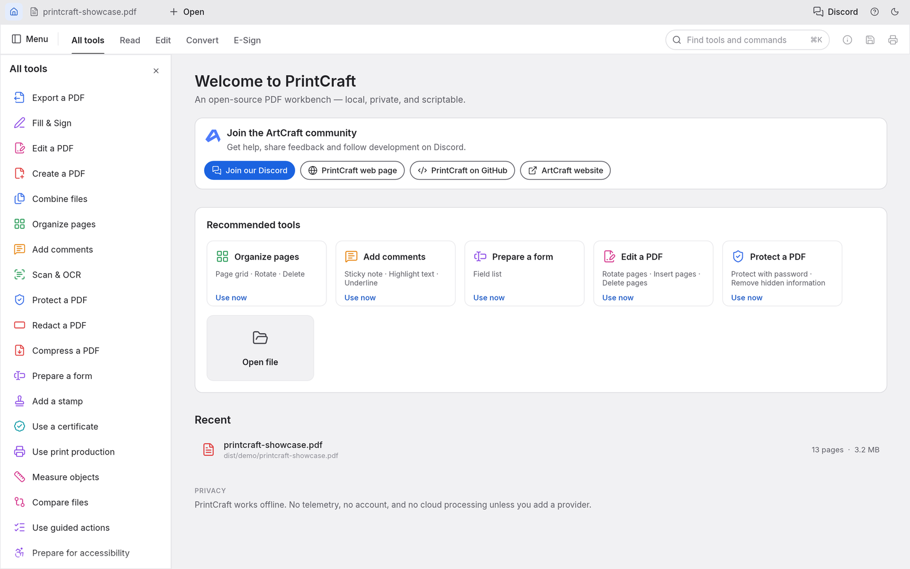</td>
</tr>
<tr>
<td align="center"><sub>The <kbd>⌘K</kbd> command palette</sub></td>
<td align="center"><sub>The home screen and the All tools catalogue</sub></td>
</tr>
</table>

---

## Get started

[View all releases](../../releases)

| Platform | Download | Run |
|----------|----------|-----|
| **Windows x64** | [pdfcraft-x64.7z](../../releases) | Run installer → launch `pdfcraft-x64.7z` |
| **Linux x64** | [pdfcraft-Linux-x64.run](../../releases) | `chmod +x` → run installer |
| **macOS Apple Silicon** | [pdfcraft-macOS-arm64.dmg](../../releases) | Open DMG → drag to Applications |

---

## Built for agents, too

Every engine feature is reachable without the GUI, through one table of JSON-Schema-described tools: open, inspect, render pages to PNG, extract and find text, rotate, delete, move and insert pages, edit bookmarks and page labels, add, reply to, restyle and delete comments (highlight a phrase just by naming it), list and fill in form fields, protect with passwords, set metadata, undo and redo, save, combine, extract and split. Three front doors share it:

- **`pdfcraft-cli run`**, for one-off calls and JSON scripts:

  ```sh
  pdfcraft-cli tools                                        # every tool and its JSON Schema
  pdfcraft-cli run text_find doc=1 query=invoice            # key=value; values parse as JSON
  pdfcraft-cli run --script review.json                     # e.g. comment_add {"type": "highlight", "find": "total due"}
  pdfcraft-cli run --script steps.json --root ./work        # several steps in one session
  ```

  With `--root`, every file the script's steps read or write stays in that directory, including the PNG a step saves with `"out"` (the script itself is read from wherever you name it).

- **An MCP server**, for AI agents such as Claude. **It is opt-in:** PdfCraft never starts it on its own, and it opens no network port. It runs only while an agent launches `pdfcraft-cli mcp`, talks over stdin/stdout, and stops when the agent disconnects. To enable it, add it to your agent's MCP configuration:

  ```json
  { "mcpServers": { "pdfcraft": { "command": "pdfcraft-cli", "args": ["mcp", "--root", "/path/to/your/pdfs"] } } }
  ```

  `--compact` shrinks the tool list the agent has to read: `tools/list` returns about ten core tools plus `tool_search` and `tool_call`, which find and run every other tool, so the list costs far fewer tokens. Every tool still works.

  `--root` confines every file the agent can read or write to one directory. Builds that should not include the server at all can use `cargo build -p pdfcraft-cli --no-default-features`.

- **The Rust API** (`pdfcraft_automation::Automation::call`), for embedding.

Edits stay in memory, undoable, until `doc_save`. Saving to the same file appends an incremental update, so the original bytes are preserved, and the write is atomic. Unsaved changes are never discarded silently.

### Driving the app itself

Start the desktop app with `pdfcraft --control /tmp/pc.json` and an agent can see and operate the real interface: the widget tree with labels and positions (from the accessibility tree), clicks, typing, keys, commands, view options and screenshots. This is also off by default. It listens only on loopback, and every connection must present the random token written to that file, which only you can read.

```sh
pdfcraft-cli ui --control /tmp/pc.json inspect query=rotate      # find widgets
pdfcraft-cli ui --control /tmp/pc.json click label="Organize pages"
pdfcraft-cli ui --control /tmp/pc.json key key=K modifiers='["command"]'
pdfcraft-cli ui --control /tmp/pc.json command id=comment.square   # pick a tool, then draw:
pdfcraft-cli ui --control /tmp/pc.json drag from='[400,300]' to='[600,420]'
pdfcraft-cli ui --control /tmp/pc.json screenshot --out window.png
```

---

## How it's built

PdfCraft is a Cargo workspace of focused crates, layered so the core never depends on the UI:

| Crate | What it does |
|---|---|
| `pdfcraft-filters` | Every PDF stream filter (Flate, LZW, ASCII85, RunLength, predictors), encode and decode, property-tested |
| `pdfcraft-crypt` | The standard security handler: RC4, AES-128/256, revisions 2–6, permissions |
| `pdfcraft-cos` | The PDF object layer: tolerant parsing, repair, copy-on-write edits, incremental and full writing |
| `pdfcraft-organize` | Page operations, combine / extract / split, bookmarks, page labels, document information |
| `pdfcraft-fonts` | Font metrics and encodings for generated appearances |
| `pdfcraft-annot` | Comments: builders and appearance streams for notes, text markup, shapes, ink and text boxes; replies, status, edits |
| `pdfcraft-forms` | Interactive forms: the field model, filling with regenerated appearances, Clear form |
| `pdfcraft-render` | Rendering, inspection and text extraction with reading order |
| `pdfcraft-engine` | The façade every frontend uses: sessions, edits, undo, saving, the tool catalogue |
| `pdfcraft-automation` | Agent control: the headless tool table, `pdfcraft-cli run`, and the opt-in MCP server |
| `pdfcraft-ui-egui` | The desktop and web interface |

**Quality gates.** Every change passes the same automated checks:
- formatting, and Clippy with warnings as errors;
- 200+ unit, property and UI tests;
- crate-layering rules and a WebAssembly build check;
- an asset-licence audit.

On top of those, two corpus sweeps run over real-world files:
- **Opening and rendering:** of the 983 pdf.js test files, 963 open and render cleanly, with 0 crashes.
- **Open, edit and save round trips:** 958 succeed.

The output is verified with independent tools: hayro, qpdf and poppler.

PdfCraft is a clean-room implementation. Its behaviour comes from the ISO 32000 specification and black-box observation, never from anyone else's code.

---

## License and credits

PdfCraft is dual-licensed under [MIT](LICENSE-MIT) or [Apache-2.0](LICENSE-APACHE), at your option.
Copyright (c) 2026 ArtCraft Team and the PdfCraft contributors. Required notices are in [NOTICE](NOTICE).
